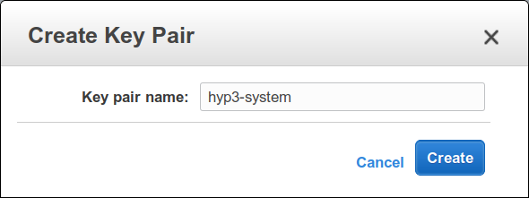
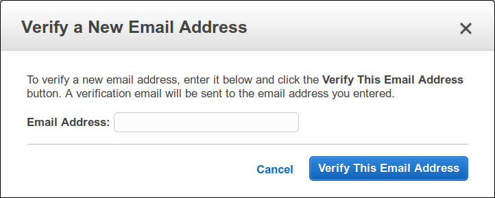
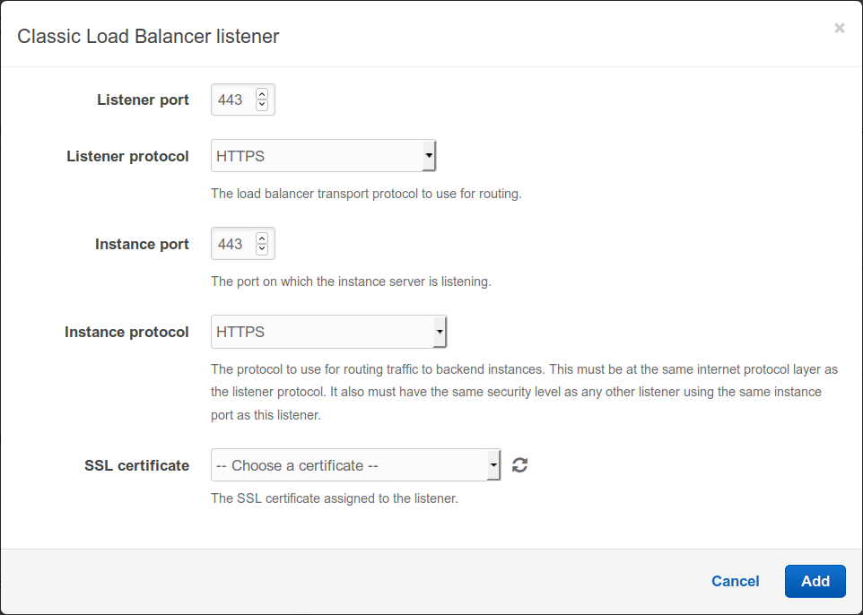

.. _setup:

Setup In Your Own AWS Account
=============================

Getting HyP3 up and running in your own AWS account is made relatively simple
through CloudFormation templates. The majority of the work will be taken care of
for you, however, some of the configuration options (such as the SES Authorized
email to send notifications from) will require you to do some preparation before
being able to create the CloudFormation stack.

Overview
--------

Here is an outline of the steps required to get the HyP3 stack running
successfully. Our goal is to make this list as short as possible. Further
details on each of these steps will be available in the following sections.

1. Zip Lambda code/dependencies and upload to S3 Bucket
2. Zip HyP3 API code and upload to S3 Bucket
3. Generate an EC2 Key Pair
4. Authorize an email address in SES
5. Generate the CloudFormation template
6. Launch a new stack from the CloudFormation template

Optional
~~~~~~~~
7. Enable HTTPS on the HyP3 API (`recommended`)
8. Enable EarthData login for the HyP3 API

1. Zipping Lambda Code With Dependencies
----------------------------------------

**Note:** `You can skip the zipping step if you have the prebuilt zip files
provided by ASF. However, you will still need to upload them to your own S3
Bucket.`

Building AWS Lambda function source bundles is as simple as zipping up the
source code. However, if the code has any external dependencies, those must also
be included in the zip file, as Lambda will not install dependencies at run
time. For creating the HyP3 Lambdas you can use the :ref:`build_lambda_script`
helper script.

To build all lambda functions in the ``lambdas/`` directory:
  1. ``cd hyp3-in-a-box/``
  2. ``mkdir -p build/lambdas``
  3. ``python3 build_lambda.py -a -o build/lambdas/ lambdas/``

This command will tell ``build_lambda.py`` to look through the ``lambdas/``
directory and bundle the source for each lambda along with any dependencies
defined in the ``requirements.txt`` file into a zip file and place it into the
``build/lambdas/`` directory. This also handles the special case for the
``psycopg2`` package which needs to be specially built for AWS Lambda.

Upload to S3
~~~~~~~~~~~~
You will need to store the source code for the lambda functions in an S3 Bucket
`in the same region as the rest of the HyP3 system`. If the bucket is not in the
same region, CloudFormation will fail to locate it.

1. Create an S3 bucket named ``your-organization-hyp3-source``
2. Create a folder called ``prod/``
3. Upload each of the lambda zip files into the ``prod/`` folder

You must upload the zip files prior to launching the CloudFormation stack, as
CloudFormation will attempt to create the components of HyP3 using the source
packages in this bucket.

2. Zipping HyP3 API
-------------------

**Note:** `You can skip the zipping step if you have the prebuilt zip file
provided by ASF. However, you will still need to upload it to your own S3
Bucket.`

Currently, the HyP3 API requires a config file containing OAuth credentials for
enabling login with EarthData SSO as well as database credentials. This means
you will have to include the config file in the zip bundle for the HyP3 API to
launch correctly.

1. Clone the hyp3-api repo
2. ``cd hyp3-api/hyp3-flask/``
3. ``cp config_template.json config.json``
4. Delete the "mysql" section and optionally fill out the "oauth" section. You can leave the "oauth" section blank if you don't plan on authenticating with EarthData SSO
5. ``cd hyp3-api`` (back to the parent directory)
6. ``python3 zip_app.py``

The zip package will now be available in ``build/hyp3-api.zip``.

`This step is subject to change in future iterations as we move towards using
environment variables for configuration instead of a file packaged with the
zip. Currently only database credentials support environment variables.`

Upload to S3
~~~~~~~~~~~~
Upload the ``hyp3-api.zip`` to the same place as the lambda zip files.

3. Generating an EC2 Key Pair
-----------------------------

In order to connect to a running EC2 instance you will need to generate an SSH
key pair. When an EC2 instance is launched with a key pair, AWS places the
public key in the instance's ``authorized_keys`` file, allowing you to connect
via SSH with the associated private key.

If you have a key pair already, you may want to use that for the HyP3 stack as
well, or you could generate a new key just for HyP3. Either way, make sure you
have access to the private key file, so that you are able to diagnose the
processing instances on the off chance that they experience any issues.

Key pairs are created in the
`EC2 management console <https://console.amazonaws.com/ec2>`_. Go to ``Network
& Security`` > ``Key Pairs`` and click "Create Key Pair".

Enter a meaningful name and hit "Create".

Make sure you save the private key ``.pem`` file as this is the only time you
will be able to download it. Amazon only stores the public key. It's also a good
idea to save this file to the ``.ssh`` folder in your home directory and to set
the permissions to be readable only by you with
``sudo chmod 0400 ~/.ssh/mykey.pem``.

For more information see the official `AWS Key Pair Documentation`_.

4. Authorizing an email for SES
-------------------------------

There are 2 steps to fully authorizing an email address with Amazon. First you
will need to verify that you own the email address through the
`SES management console <https://console.amazonaws.com/ses>`_. Go to ``Email
Addresses`` and click "Verify a New Email Address". Enter the email address
which HyP3 will use to send notification emails once new data is available and
click "Verify This Email Address". Amazon will send an email containing a
verification link to this address.

This will allow you to send emails `to` the HyP3 email address, but your account
will likely still be in sandbox mode, preventing you from sending emails to any
non verified addresses. This is to prevent email spammers from abusing SES.

To get the sandbox restriction removed from your account, you will need to open
a sending limit increase request with the Support Center. This request will both
allow your account to get out of sandbox mode, and increase the daily email
limit of 200 emails every 24 hours.

We recommend that you request a limit of at least 50 emails per expected
subscription (across all users). So if you expect to have 10 users with 10
subscriptions each, you should request a rate limit of at least
``10 * 10 * 50 = 5000``. In future iterations of the HyP3 system this number may
be lower as we work on implementing a notification accumulator, which will
combine notifications occurring close to each other into a single email.

For more details on opening the Support Center sending limit increase request
see the official `AWS Removing SES Sandbox Documentation`_.

5. Generating the CloudFormation template
-----------------------------------------

You can generate the template using the ``create_stack.py`` script located in
``cloudformation/tropo/``. The script requires a few dependencies which you can
install to a virtual environment.

**Note:** `You will need Python 3 to create the template! Make sure your
virtual environment is using Python 3.`

1. ``cd cloudformation``
2. ``virtualenv -p python3 .venv``
3. ``source .venv/bin/activate``
4. ``pip install -r requirements.txt``
5. ``python3 tropo/create_stack.py --lambda_bucket MY_BUCKET --eb_bucket MY_BUCKET --maturity prod tropo/outputs/hyp3_stack.json``

Make sure that ``MY_BUCKET`` is the bucket you created in step 1 which contains
all of the source code for the HyP3 components. Also make sure that the maturity
matches the name of the folder that you placed the bundles into.

The resulting template will be written to ``tropo/outputs/hyp3_stack.json``. You
can now use this to launch your own HyP3 stack.

**Note:** `If you will be launching the stack programmatically or through the
AWS CLI, you will need a configuration.json file. You can create this by passing
the` ``--config`` `option to` ``create_stack.py``.

6. Launching the CloudFormation stack
-------------------------------------

Head over to the
`CloudFormation management console <https://console.amazonaws.com/cloudformation>`_
and click "Create Stack".

1. Under "Choose a template" select "Upload a template to Amazon S3"
2. Click "Browse..." and select ``hyp3_stack.json`` from the previous step. Hit "Next"

.. image:: images/cloudformation_create_stack.png
   :alt: Create stack

3. Enter a stack name
4. Configure parameters as needed. Hit "Next"

**Note:** `You can leave some parameters blank and they will be generated
randomly. Important parameters like passwords will appear in the template
outputs.`

5. On the "Options" page hit "Next"
6. On the "Review" page check the "I acknowledge that AWS CloudFormation might create IAM resources" box and hit "Create"

7. Enabling HTTPS (Recommended)
-------------------------------

By default the HyP3 API will only be running on an unsecured HTTP connection.
This is because the API is running through ElasticBeanstalk which Amazon does
not sign SSL certificates for by default. If the API is migrated to API Gateway
in the future this step may not be necessary as API Gateway exclusively supports
HTTPS.

It is a good idea to enable HTTPS because users will need to authenticate with
the API using their API key. The API key is intended to be kept secret, and
sending it over an unencrypted connection allows anyone sniffing the network to
read it and gain access to your processing resources.

There are 3 components which you will need to enable HTTPS:

1. A Domain Name for the API
2. A `CNAME Record`_ linking your domain to the ElasticBeanstalk domain
3. An SSL Certificate signed for your domain

How you obtain a domain name and CNAME record for the API depends on your
organization. Larger organizations like Academic Institutions often run their
own DNS servers and you will have to ask them about getting your own subdomain.
If your organization is not associated with a University you can get your domain
through any number of providers such as Google Domains or Amazon Route 53.

Once you have your domain you will also need to obtain a signed SSL certificate
for it. If you are associated with an Academic Institution you will likely have
to do this through them again. Otherwise you are free to submit a certificate
signing request to any recognized Certificate Authority.

The easiest way to sign certificates is with `Let's Encrypt`_. It's completely
free and only takes a few minutes. The down side is that Let's Encrypt
certificates need to be renewed every 90 days.

Once you have your signed certificate, you will need to import it into Amazon
Certificate Manager. Go to the
`ACM management console <https://console.amazonaws.com/acm>`_ and choose
"Import a Certificate".

1. Copy and paste the contents of your certificate (usually ``.crt``) into the "Certificate body" field.
2. Copy and paste the contents of your private key file (usually ``.pem``) into the "Certificate private key" field.
3. Copy and paste the contents of your certificate chain file (usually ``.pem``) into the "Certificate chain" field.

Click "Review and Import" to save and name the certificate.

Now head over to the `ElasticBeanstalk management console`_ and find the
``hyp3-api`` application created by CloudFormation. Select the ``prod``
environment and click on "Configuration". Under "Load Balancer" click "modify".
If there is no "modify" button make sure that load balancing is enabled under
the "Capacity" section.

Click "Add listener" and choose HTTPS for the "Listener protocol". This should
populate the port and instance protocol automatically. If it doesn't, make sure
they are set to 443 and HTTPS respectively.

Under "SSL certificate" you should be able to see the certificate which you
imported earlier. Select the certificate and click "Add". You can now disable
the HTTP listener and click "Apply".

8. Enabling EarthData Login (Optional)
--------------------------------------

If you want your users to be able to authenticate with the HyP3 API using NASA
EarthData SSO (Single Sign On), you will first need to register an application
with EarthData. For details see the EarthData `How To Register An Application`_
page.

Once you have an active application you will need to repeat step 2 (Zipping
HyP3 API) with the credentials for your application. After you have uploaded the
zip file you will need to get ElasticBeanstalk to use the new zip file by
deploying a new application version in the
`ElasticBeanstalk management console`_.

.. _AWS Key Pair Documentation: https://docs.aws.amazon.com/AWSEC2/latest/UserGuide/ec2-key-pairs.html
.. _AWS Removing SES Sandbox Documentation: https://docs.aws.amazon.com/ses/latest/DeveloperGuide/request-production-access.html
.. _CNAME Record: https://en.wikipedia.org/wiki/CNAME_record
.. _Let's Encrypt: https://letsencrypt.org/
.. _How To Register An Application: https://developer.earthdata.nasa.gov/urs/urs-integration/how-to-register-an-application

.. _ElasticBeanstalk management console: https://console.amazonaws.com/elasticbeanstalk
