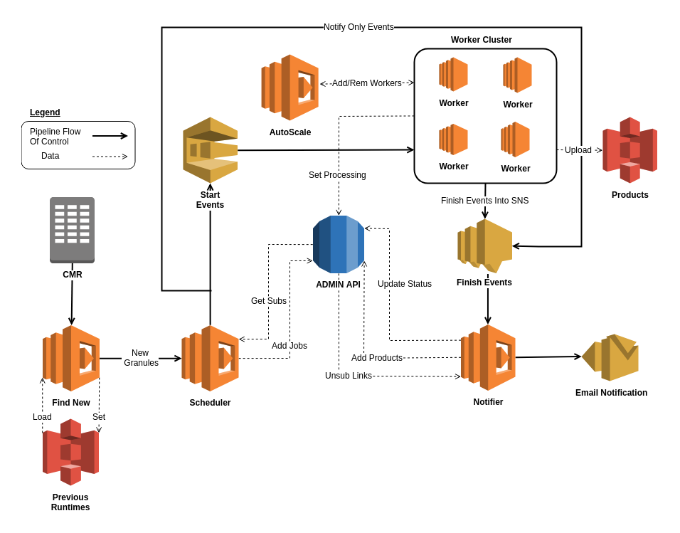

.. Hyp3 In A Box documentation master file, created by
   sphinx-quickstart on Tue Jun  5 11:11:18 2018.
   You can adapt this file completely to your liking, but it should at least
   contain the root `toctree` directive.

Welcome to Hyp3 In A Box's documentation!
=========================================

.. toctree::
   :maxdepth: 2
   :caption: Contents:

   _static/cloudformation
   _static/lambdas-main

The Hybrid Pluggable Procecssing (HyP3) System
----------------------------------------------

   Diagram of the hyp3 system. All these resourse get automatically created
   using `AWS Cloudformation`_.

Start Events
~~~~~~~~~~~~

Holds information about the event like processing type, granules, etc.
Connects to a job entry in the database.

Finish Events
~~~~~~~~~~~~~

Holds info about the outcome of the processing like status, products, as well as all the
general job info (also connected to job entry).

Admin API
~~~~~~~~~

A `Flask`_ app that uses `Zappa`_ to make a serverless API that
interfaces with the database.

**Responsibilities:**

* get all subs
* get all jobs
* start job
* update job
* add products
* get email unsubscribe link

Indices and tables
------------------

* :ref:`genindex`
* :ref:`modindex`
* :ref:`search`

.. _AWS Cloudformation: https://aws.amazon.com/cloudformation/
.. _Zappa: https://github.com/Miserlou/Zappa
.. _Flask: http://flask.pocoo.org/
