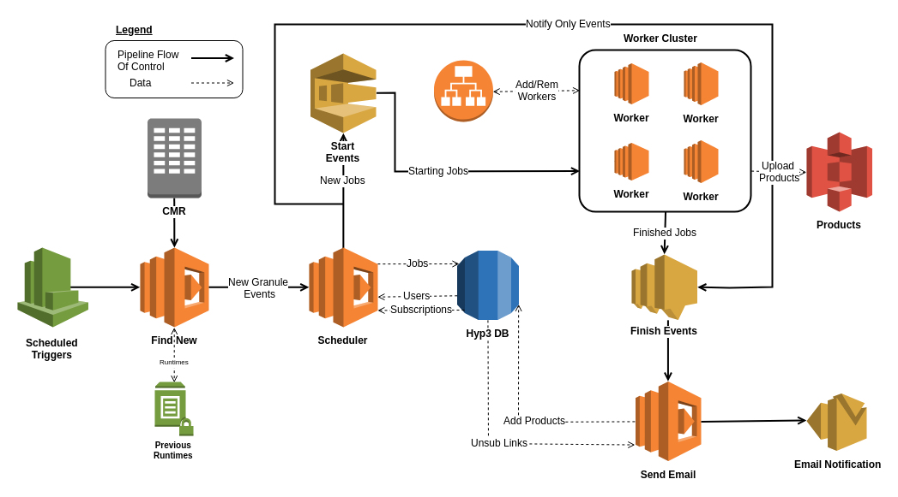

.. HyP3 In A Box documentation master file, created by
   sphinx-quickstart on Tue Jun  5 11:11:18 2018.
   You can adapt this file completely to your liking, but it should at least
   contain the root `toctree` directive.

HyP3 In A Box's Documentation
=============================

.. cssclass:: badge-margin

   .. image:: https://s3-us-west-2.amazonaws.com/asf-docs/hyp3-in-a-box/test-build-status.svg
      :target: https://github.com/asfadmin/hyp3-in-a-box

   .. image:: https://s3-us-west-2.amazonaws.com/asf-docs/hyp3-in-a-box/test-coverage-status.svg
      :target: https://github.com/asfadmin/hyp3-in-a-box

   .. image:: https://www.codefactor.io/repository/github/asfadmin/hyp3-in-a-box/badge/master
      :target: https://github.com/asfadmin/hyp3-in-a-box

   .. image:: https://img.shields.io/badge/python-3.6-blue.svg
      :target: https://www.python.org/

   .. image:: https://img.shields.io/badge/cloud%20provider-aws-FF9900.svg
      :target: https://aws.amazon.com/

   .. image:: https://img.shields.io/badge/license-GPL--3.0-blue.svg
      :target: https://www.gnu.org/licenses/gpl-3.0.en.html

.. toctree::
   :maxdepth: 1
   :caption: Contents:

   _static/setup
   _static/releases
   _static/dev-setup
   _static/cloudformation
   _static/lambdas-main
   _static/modules

The Hybrid Plugable Processing Pipeline (HyP3) System
-----------------------------------------------------

   Diagram of the hyp3 system. All these resources get automatically created
   using `AWS CloudFormation`_.

Indices and tables
------------------

* :ref:`genindex`
* :ref:`modindex`
* :ref:`search`

.. _AWS Cloudformation: https://aws.amazon.com/cloudformation/
.. _Zappa: https://github.com/Miserlou/Zappa
.. _Flask: http://flask.pocoo.org/
